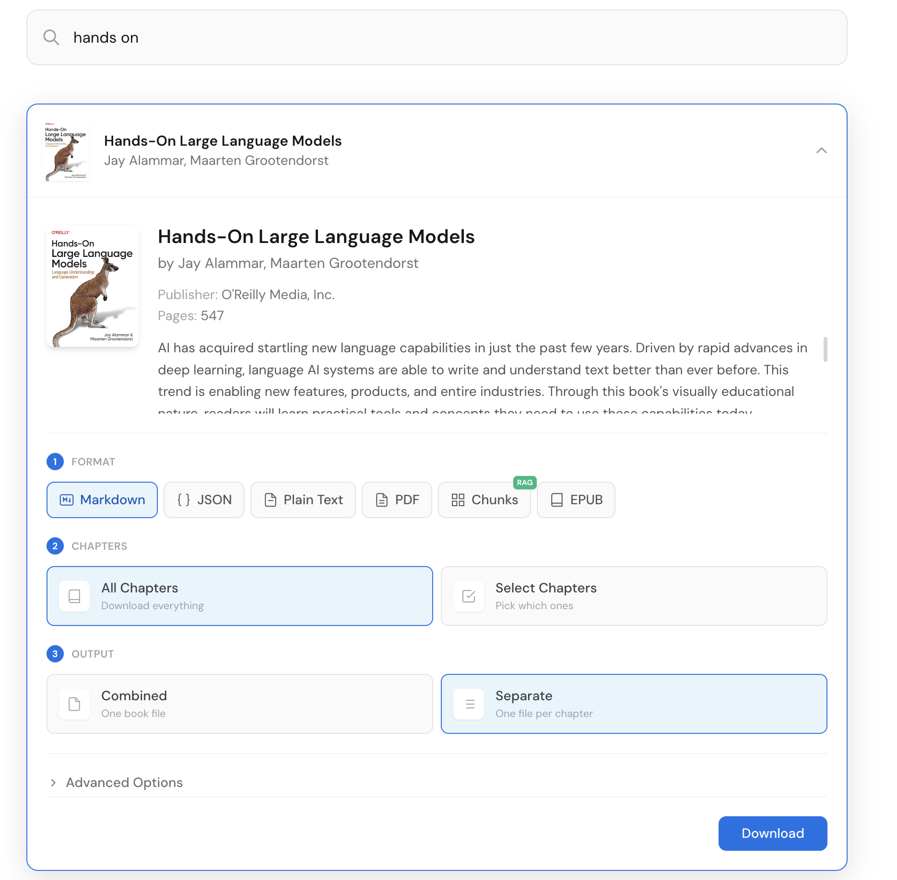
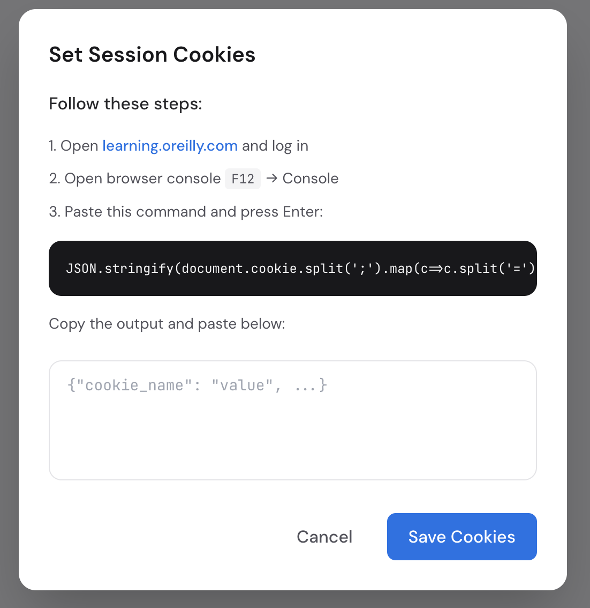

# O'Reilly Ingest

We're in the AI era. You want to chat with your favorite technical books using Claude Code, Cursor, or any LLM tool. This gets you there.

Export any O'Reilly book to Markdown, PDF, EPUB, JSON, TOON, or plain text. Download by chapters so you don't burn through your context window.

> Requires a valid O'Reilly Learning subscription.

## Disclaimer

For personal and educational use only. Please read the [O'Reilly Terms of Service](https://www.oreilly.com/terms/).

## Credits

Fork of [oreilly-ingest](https://github.com/Mosaibah/oreilly-ingest) by [@Mosaibah](https://github.com/Mosaibah).

Inspired by [safaribooks](https://github.com/lorenzodifuccia/safaribooks) by [@lorenzodifuccia](https://github.com/lorenzodifuccia).


## Features

- **Export by chapters** - save tokens, focus on what matters
- **LLM-ready formats** - Markdown, JSON, TOON, plain text optimized for AI
- **Traditional formats** - PDF and EPUB 3
- **O'Reilly V2 API** - fast and reliable
- **Images & styles included** - complete book experience
- **Web UI** - search, preview, download
- **Audiobooks** - download tracks and play them in the browser
- **Download queue** - queue many books, one at a time, pause and resume
- **Built-in library** - read your EPUBs in the browser, no external reader
- **"Para después" list** - save titles now, download them later
- **Translation with a local model** *(beta)* - translate while downloading, on your own GPU



## Quick Start

### Docker

```bash
git clone https://github.com/hannahNchan/oreilly-downloader.git
cd oreilly-downloader
docker compose up -d
```

### Python

```bash
git clone https://github.com/hannahNchan/oreilly-downloader.git
cd oreilly-downloader
python3 -m venv .venv && source .venv/bin/activate
pip install -r requirements.txt
python main.py
```

Then open http://localhost:8000

## Setting Up Cookies

Click "Set Cookies" in the web interface and follow the steps:



Open the console on a logged-in `learning.oreilly.com` tab, run
`copy(document.cookie)`, and paste. Two formats are accepted, so it doesn't
matter how you copied them:

```
orm-jwt=eyJ...; _abck=...; bm_sz=...      <- the raw document.cookie string
{"orm-jwt": "eyJ...", "_abck": "..."}     <- or JSON
```

`orm-jwt` is the session cookie and is required. Without it the paste is
rejected up front, instead of being saved as a set that fails on the first
download.

O'Reilly rotates that token every few minutes and there is no way to renew it
from here, so expect to paste again during long jobs. That is what the queue's
pause is for.

## Downloads

Downloads land in `output/` first and are published to the library afterwards.
Writing straight into a remote folder stretched the network phase — thousands of
small writes with per-file latency — exactly when the O'Reilly token has minutes
to live.

### The queue

One download at a time, in order. Deliberate, not a simplification: the HTTP
client is shared and resets its cookie jar per request, so two downloads at once
would step on each other, and raising the request rate against O'Reilly is what
triggers the blocks.

- **Select many at once.** With search results on screen, hit **Múltiples**, tick
  the books you want, and open the batch modal. Each entry expands for its own
  format, translation and *Omitir imágenes* — per book, not global.
- **Close the modal and it keeps going.** A floating pill shows how many are
  active and reopens the modal with live progress. It shows the current downloads
  only, not the history of the session.
- **Session expiry pauses instead of failing.** The job stops at `paused`, the
  queue holds, and the cookie form appears *inside* the downloads modal. Paste,
  press the button, and it continues from where it was.
- **Resuming is cheap.** Fetched chapters are cached per book and audio tracks
  already on disk are skipped, so a retry doesn't re-download what you have.
- **Only one server downloads.** Two servers pointing at the same `data/` would
  work the same queue. The first to take an OS-level lock on `data/queue.lock`
  runs it; the other serves and displays the queue but executes nothing, and says
  so in the UI. It takes over on its own if the first one closes.

### Mis libros

The **Mis libros** menu holds two sections:

- **Biblioteca** — everything on disk. EPUBs open in a built-in reader (epub.js,
  vendored, no CDN); audiobooks get a player with chapter names, and incomplete
  downloads are flagged.
- **Para después** — titles saved for later, in `data/watchlist.json`. Anything
  already downloaded is marked as such, and **Limpiar descargados** clears those
  from the list in one go. It asks first, and it never touches the files.

### Where the library lives

**Settings** (gear icon) sets the library folder. Unset, it defaults to
`output/library`: the app builds the structure there and nothing else is needed.
Point it anywhere you like, including a network share — downloads still go
through the local cache first and are transferred on completion, verified byte
for byte.

## Translation (local model)

> **BETA.** The output is not proofread. Treat it as a draft, not a finished
> translation.

Chapters are translated by a model running on your own machine, as part of the
download. Nothing is sent to a third-party service and no API key is involved.

The engine is **NLLB-200-3.3B**, Meta's dedicated translation model, on
CTranslate2 in int8. It is an encoder-decoder translation model, not a
general-purpose chat model: it has no system prompt, so it cannot refuse,
comment or add a preamble. Text in, translated text out - which removes every
line of output validation an instruction-following model would need.

It runs as its own service under [`services/translator`](services/translator),
with its own venv, because CUDA has nothing to do with this app's dependencies
and the app has to keep starting on a machine without a GPU.

### Setup

```powershell
cd services	ranslator
.\setup.ps1
```

Then start it and leave it running:

```powershell
.
un.ps1
```

Pick a language under **Translate** in the download modal. `Original (no
translation)` is the default, so nothing changes until you ask for it. If the
service is not answering with a loaded model, the download fails immediately
instead of quietly handing you an untranslated book.

The VRAM budget, the batch-size table and what to do when CUDA is not visible
are all in [`services/translator/README.md`](services/translator/README.md).

### Configuration

The app side lives in `config.py`:

| Setting | Default | What it does |
|---------|---------|--------------|
| `TRANSLATOR_URL` | `http://127.0.0.1:8100` | Where the service listens |
| `TRANSLATE_REQUEST_CHARS` | `150000` | Characters per request to the service |
| `TRANSLATE_REQUEST_ITEMS` | `500` | Blocks per request |
| `TRANSLATE_TIMEOUT` | `600` | Seconds allowed per request |
| `TRANSLATE_LANGUAGES` | `es-LATAM` | Target languages offered in the UI |
| `NLLB_TARGET_LANGS` | `es-LATAM -> spa_Latn` | FLORES-200 tag per language. NLLB does not speak ISO-639: `es` means nothing to it, `spa_Latn` does |

Decoding (beam size, batch tokens, VRAM guards) belongs to the service and lives
in `services/translator/app/config.py`.

### How the markup survives

The model cannot be told anything, so the tags are taken out of its way and put
back afterwards. Each block becomes a template where every piece of markup is a
numeric placeholder:

```
<p>The <code>pd.Series</code> class is a <i>blueprint</i>.</p>
  becomes
"The %%0%% class is a %%1%%blueprint%%2%%."
```

The model sees the whole sentence - which is what it needs to get Spanish word
order right - and carries the placeholders along with the words they belong to.

- **Code is never translated, and cannot be.** `pre`, `code`, `kbd`, `samp`,
  `var`, `tt`, `script`, `style`, images, `svg` and MathML never reach the model
  at all: they sit in a placeholder and come back verbatim. There is nothing to
  verify afterwards, because there was never an opportunity to corrupt them.
- Text is translated **per block** - paragraph, list item, heading, table cell,
  and any `div` holding only inline content - never per text node. A sentence
  broken up by `<em>` or `<code>` reaches the model as one sentence, which is the
  difference between a translation and word salad.
- **Losses are graded, not fatal.** A placeholder can come back missing with the
  text around it translated perfectly. It is not common on real chapter markup -
  a 13-block sample carrying 18 placeholders lost one formatting pair and no
  protected content - but it happens, and it does not scale with how many
  placeholders a sentence holds. So they are classified. Losing a
  `<code>` placeholder would delete content, so that block is rejected and
  retried with inline formatting flattened, which leaves far fewer placeholders
  to lose. Losing an `<i>` costs only italics, so the translation is kept and the
  formatting is dropped - a Spanish paragraph without italics beats an English
  one with them. Only a block that loses its code twice keeps its English.
- Attributes are restored from the original element and never sent, so an `href`
  cannot come back corrupted.

### Known limits

- **`<i>` and `<b>` inside a sentence may not survive.** See above: the
  translation is kept, the emphasis is not. Links always keep their text and
  sometimes lose the link.
- **No glossary yet.** The model cannot be told "keep identifiers in English", so
  it translates *string*, *array* and *commit* as ordinary words. Protecting them
  needs a term list running through the same placeholder mechanism.
- **One Spanish.** FLORES-200 has a single `spa_Latn`; there is no es-419 and no
  prompt to ask for neutral Latin American Spanish. That is produced by a
  deterministic post-edition list in the service
  (`services/translator/data/postedit_spa_Latn.txt`), which you can edit.
- **Your O'Reilly session may be shorter than the job.** Chapters are all fetched
  first and translated afterwards, so the session only has to survive the
  download phase. If it does expire mid-download you get an explicit error, not a
  silently truncated book - paste fresh cookies and run it again.
- Only `es-LATAM` ships configured.

## Architecture

Plugin-based microkernel design:

| Layer | Components |
|-------|------------|
| **Kernel** | Plugin registry, shared HTTP client |
| **Core** | Auth, Book, Chapters, Assets, HtmlProcessor, Audiobook |
| **Output** | Epub, Markdown, Pdf, PlainText, JsonExport, ToonExport |
| **Storage** | Output (local cache), Library (published works), Watchlist |
| **Utility** | Chunking, Token, Translator, Downloader, Queue, System |

The library is content-addressed: `work_id = sha1("urn:orm:{kind}:{book_id}")[:8]`,
sharded by its first two characters, so `index/library.json` can be rebuilt from
disk at any time. Download state is derived, never stored — a work counts as
downloaded because the files are there, not because a flag says so.

### API

```
GET  /api/status                      - auth check
GET  /api/search?q=                   - find books
GET  /api/book/{id}                   - metadata
GET  /api/audiobook/{id}              - audiobook metadata
POST /api/download                    - queue an export
POST /api/cookies                     - store a fresh session
GET  /api/progress                    - SSE stream

GET  /api/queue                       - jobs, active, paused, owner
POST /api/queue/{job}/cancel          - drop one job
POST /api/queue/clear                 - forget finished jobs

GET  /api/library                     - works on disk
GET  /api/library/file/{w}/(epub|pdf) - stream a file (Range supported)
GET  /api/library/audio/{w}/{n}       - stream a track (Range supported)
POST /api/library/transfer            - publish from cache to the library

GET  /api/watchlist                   - "Para después", with download state
POST /api/watchlist                   - save a title
POST /api/watchlist/{id}/remove       - drop one
POST /api/watchlist/clear-downloaded  - drop everything already downloaded

GET  /api/settings                    - current preferences
POST /api/settings/library-dir        - set the library folder
```

## Contributing

Found a bug or have an idea? PRs and issues are always welcome!


## Recent Changes

- **Sequential download queue** — many books queued, one at a time. Session
  expiry pauses the queue instead of losing the job; pasting fresh cookies
  resumes it from where it was.
- **Multi-select downloads** — pick several search results and configure each one
  separately (format, translation, skip images) in a single modal.
- **"Para después" watchlist** — save titles before downloading them, under the
  new **Mis libros** menu, with a one-click clean-up of the ones already on disk.
- **Built-in library and reader** — content-addressed storage, a self-healing
  index rebuilt from disk, an in-browser EPUB reader, and an audiobook player with
  incomplete-download detection.
- **User-configurable library folder** — set in Settings, defaults to
  `output/library`. Downloads use the local cache first and are transferred and
  verified afterwards.
- **Session detection: fewer false alarms** — a short chapter ending in an
  ellipsis is no longer assumed to be a paywall preview. The session is verified
  against a chapter that already came back in full, so genuinely short chapters
  (conclusions, appendices) no longer stall a download that no cookie could fix.
- **Cookie input accepts both formats** — the raw `document.cookie` string or
  JSON, with `orm-jwt` required, and the result checked against the server
  instead of reporting success blindly.
- **One downloader per machine** — an OS-level lock decides which server runs the
  queue, released automatically when the process dies. Others display the queue
  and take over on their own if the owner closes.
- **Chunking: streaming & memory fix** — `chunk_book()` now streams chunks directly to disk instead of accumulating in memory. Replaced `tiktoken` tokenizer with a word-count heuristic to avoid memory spikes on large books. (@zirkleta)
- **System: command injection fix** — `_show_macos_picker()` rejects paths containing `"` before interpolating into osascript, preventing command injection via crafted directory names. (@zirkleta)
- **`patch_chunk_titles.py`** — New utility script that backfills `book_title` into existing `*_chunks.jsonl` files in the output directory. (@zirkleta)

## License

MIT
